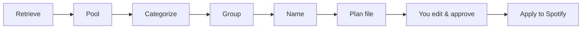
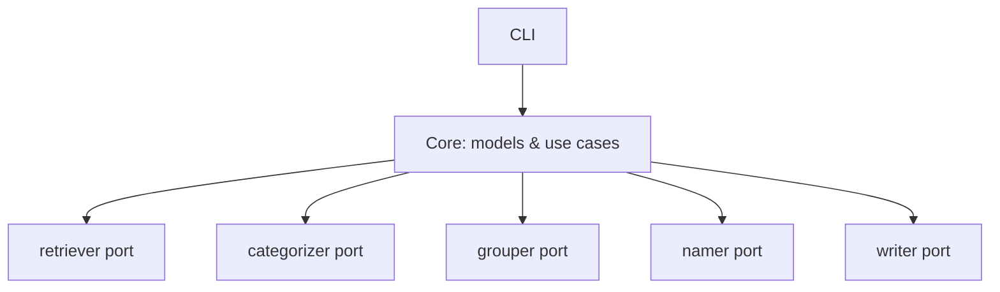

# MixMansion

MixMansion is a Spotify playlist organizer that sorts your songs into new playlists by mood and vibe, using genre and mood similarity plus an LLM to name the results, with a plan you review and approve before anything changes on Spotify.

[](https://github.com/janthoXO/MixMansion/actions/workflows/release.yml)

[](LICENSE)

MixMansion is not affiliated with or endorsed by Spotify.

## Status

The core pipeline (models, use cases, plan lifecycle, CLI) is implemented and tested. The connectors that talk to the outside world — the Spotify client, the playlist and search retrievers, the genre and mood categorizers, the Louvain grouper, the LLM namer, the Spotify writer, and the pool/plan file stores — are planned but not implemented yet (see the [open issues](https://github.com/janthoXO/MixMansion/issues)). Until they land, `mixmansion --help` works, but `pool add`, `plan` and `apply` have no adapters registered to run against. This README documents the tool as it is meant to work once those connectors ship; sections that depend on a specific connector say so.

## Features

- Builds a pool of songs from several sources (existing playlists, free-text search, more to come)
- Groups songs by weighted genre and mood similarity, not just one signal
- A song that fits two moods equally well can land in both playlists
- Names and describes each playlist with a local or cloud LLM
- Emits an editable plan file you approve before anything is written to Spotify
- Never deletes songs and never touches a playlist outside the plan

## Installation

Prerequisites:

- Python 3.12 or later and [uv](https://docs.astral.sh/uv/)
- A Spotify developer app: create one at the [Spotify developer dashboard](https://developer.spotify.com/dashboard), set its redirect URI to `http://127.0.0.1:8888/callback`, and, since the app starts in development mode, add your own Spotify account as a user under the app's settings
- A [Last.fm API key](https://www.last.fm/api/account/create) (used by the genre categorizer, once implemented)
- Either a local LLM (e.g. [Ollama](https://ollama.com/)) or an API key for a cloud LLM provider (used by the mood categorizer and the namer, once implemented)

### With uv

```bash
git clone https://github.com/janthoXO/MixMansion.git
cd MixMansion
uv sync
cp .env.example .env
# edit .env: fill in SPOTIFY_CLIENT_ID and SPOTIFY_CLIENT_SECRET at minimum
```

### With Docker

Every release publishes an image to the GitHub Container Registry. Run it from a folder that holds your `.env`; the workspace (`.mixmansion/`, with the pool, caches and Spotify token) is created there too:

```bash
docker run --rm -it -v "$PWD:/data" ghcr.io/janthoxo/mixmansion --help
```

Logging in to Spotify from inside the container comes with the Spotify connector.

## Usage

First run, once the connectors are implemented:

```bash
uv run mixmansion pool add playlist          # picker: choose playlists interactively
uv run mixmansion pool add playlist --playlist-ids <id>,https://open.spotify.com/playlist/<id>
uv run mixmansion pool add search --query "rainy day jazz"   # picker: choose search hits
uv run mixmansion pool add search --query "rainy day jazz" --track-ids <id>,<id>
uv run mixmansion pool show                  # see what's in the pool
uv run mixmansion plan -o plan.yaml          # group the pool and write a plan
# edit plan.yaml, then set `approved: true`
uv run mixmansion apply plan.yaml
```

Only playlists you own or collaborate on can be read back (a Spotify restriction for development-mode apps), so the picker and `pool add playlist` only work with those. Spotify returns at most 10 search hits per request, so `pool add search` pages through results to reach `--limit` (default 20).

### Editing the plan

`plan` writes a YAML file with `approved: false`:

```yaml
version: 1
approved: false
generated:
  pool_size: 42
  weights: {genre: 0.5, mood: 0.5}
playlists:
  - name: "Late Night Drive"
    description: "Moody synth-driven tracks for empty highways after midnight."
    spotify_id: null
    tracks:
      - {id: 4uLU6hMCjMI75M1A2tKUQC, artist: "The Midnight", title: "Sunset"}
unassigned: []
```

Open it and edit before running `apply`:

- move a track to a different playlist
- remove a track from a playlist
- add a track — a bare Spotify id, a `spotify:track:...` URI, or an `open.spotify.com/track/...` URL all work
- rename a playlist or change its description
- drop a whole playlist
- set `approved: true` once you're happy with it

`apply` refuses to run against a plan that isn't approved. It only ever creates or updates the playlists listed in the plan — nothing else on your account is touched, and no song is ever deleted. Any comments you add to the file are kept: `apply` writes back each playlist's `spotify_id` in place, leaving the rest of the file — including your comments — untouched.

New playlists are private unless you set `MIXMANSION_WRITER_SPOTIFY_PUBLIC=true`; `MIXMANSION_WRITER_SPOTIFY_NAME_PREFIX` (e.g. `"◐ "`) makes them easy to spot in your library.

## How it works


Songs are retrieved into a pool, scored for similarity on each dimension (genre, mood), grouped into playlists, named, and written to a plan file you edit and approve before `apply` touches Spotify.

## Architecture in brief

MixMansion follows ports and adapters: the core (domain models and use cases) defines an interface — a *port* — for each external concern (retrieving songs, categorizing, grouping, naming, writing to Spotify, storing pools and plans), and each port has one or more concrete *adapters*. The CLI is the current interaction surface; a REST API is planned as another one, reusing the same core.


The interaction surface (CLI) only calls the core; the core only calls ports, never a concrete adapter directly.

See [README_DEV.md](README_DEV.md) for the full architecture, the domain model, and how to add a new adapter.

## Configuration

Settings are read from real environment variables, then a `.env` file, then defaults; CLI flags override all of that for a single run. Copy `.env.example` to `.env` and fill in what you need. The most important variables:

| Variable | Purpose |
|---|---|
| `SPOTIFY_CLIENT_ID`, `SPOTIFY_CLIENT_SECRET` | Your Spotify app credentials (required) |
| `SPOTIFY_REDIRECT_URI` | Must match the app's dashboard setting; default `http://127.0.0.1:8888/callback` |
| `MIXMANSION_WORKSPACE` | Local state directory (caches, pool, tokens); default `.mixmansion` |
| `MIXMANSION_WEIGHTS` | Default categorizer weights, e.g. `{"genre": 0.5, "mood": 0.5}` |
| `MIXMANSION_GROUPER`, `MIXMANSION_NAMER` | Which grouper/namer adapter to use by default |
| `LASTFM_API_KEY` | Last.fm key for the genre categorizer *(added with the connector)* |
| `LLM_PROVIDER`, `LLM_MODEL`, `LLM_URL`, `LLM_API_KEY` | LLM used for naming and mood tagging (see below) |
| `EMBEDDINGS_PROVIDER`, `EMBEDDINGS_MODEL` | Embedding model for mood similarity (see below) |

### Local or cloud LLM

The LLM (mood tags, playlist names) and the embeddings model (mood similarity) are set separately, so you can mix them. Only the provider and model are required; everything goes through [LiteLLM](https://docs.litellm.ai/docs/providers), so any provider it supports works.

- **Local with Ollama:** `ollama pull qwen2.5:14b && ollama pull nomic-embed-text`, then `LLM_PROVIDER=ollama`, `LLM_MODEL=qwen2.5:14b`, `LLM_URL=http://localhost:11434`, and the same for `EMBEDDINGS_*` with `nomic-embed-text`. Nothing leaves your machine except the Spotify, Last.fm and LRCLIB lookups.
- **LM Studio, vLLM or another OpenAI-compatible server:** `LLM_PROVIDER=openai_compatible` and `LLM_URL=<server>/v1`.
- **Cloud:** e.g. `LLM_PROVIDER=anthropic`, `LLM_MODEL=claude-haiku-4-5`, `LLM_API_KEY=...`; embeddings e.g. `EMBEDDINGS_PROVIDER=openai`, `EMBEDDINGS_MODEL=text-embedding-3-small`, `EMBEDDINGS_API_KEY=...`.

Answers are cached in `.mixmansion/llm_cache.sqlite`, so running `plan` again on the same songs costs nothing.

See `.env.example` for the full, current list and defaults.

## FAQ

**Does MixMansion modify my existing playlists?**
No. It only creates or updates the playlists listed in a plan you've approved. Nothing else on your account is touched, and songs are never deleted from your library.

**Can I run it fully locally?**
Yes, once the LLM connector lands: point `LLM_PROVIDER`/`LLM_MODEL` at a local model server such as Ollama and no data goes to a cloud LLM. Spotify itself, of course, is always a cloud API.

**What data does it send to Spotify, Last.fm or an LLM?**
Spotify: playlist and track metadata via its Web API, plus the playlists MixMansion creates. Last.fm (planned): artist and track names, to fetch genre tags. An LLM provider (planned): song titles, artists, lyrics and tags, to generate mood labels and playlist names/descriptions.

**I'm getting a Spotify authorization error.**
Check that `SPOTIFY_REDIRECT_URI` matches the redirect URI in your app's dashboard exactly, and that your Spotify account is added as a user under the app's settings (required while the app is in development mode).

**Some songs don't get a mood, or the mood categorizer says they're "uncovered."**
Mood tags come from lyrics (via LRCLIB) and genre tags from Spotify and Last.fm, and neither source covers every song. A song without data for one dimension is still grouped using the dimensions that do have data for it — it isn't penalized for the missing one.

**The local LLM is slow.**
Local models are much slower than cloud APIs, especially for larger models. Completions and embeddings are cached on disk, so re-running the pipeline on the same pool doesn't re-query anything already answered. Try a smaller model, or a cloud provider, if speed matters more than running locally.

## Contributing

Contributions are welcome. Start with [CONTRIBUTING.md](CONTRIBUTING.md); the architecture and development setup are in [README_DEV.md](README_DEV.md). Please follow the [Code of Conduct](CODE_OF_CONDUCT.md), and report security issues as described in [SECURITY.md](SECURITY.md), not in public issues.

## License

[MIT](LICENSE). MixMansion is not affiliated with or endorsed by Spotify.
