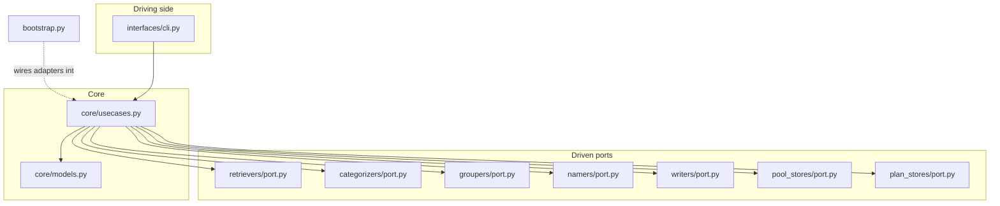
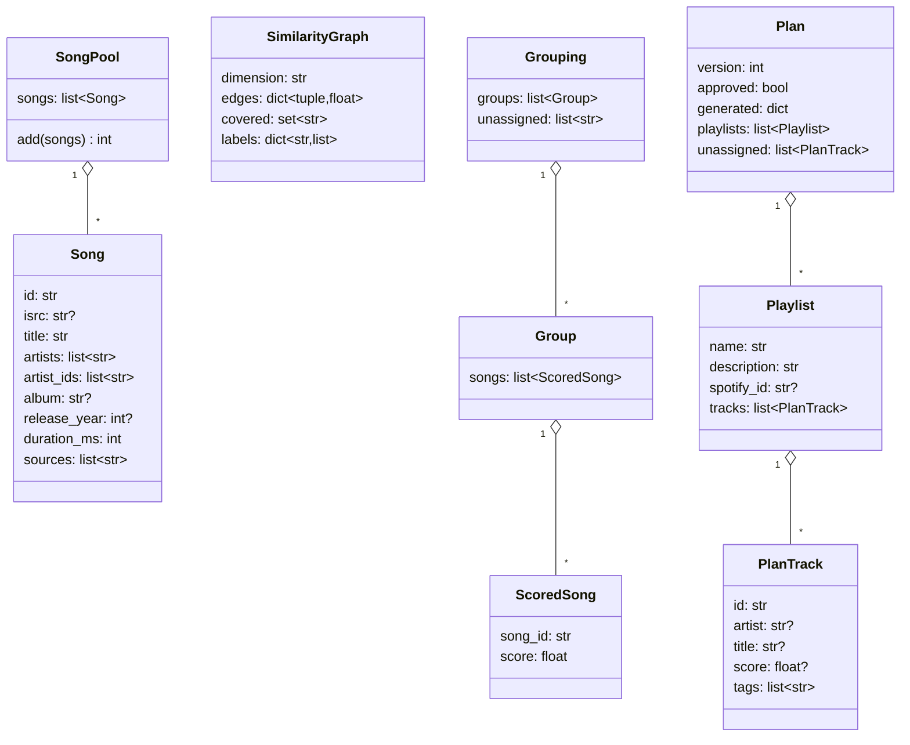
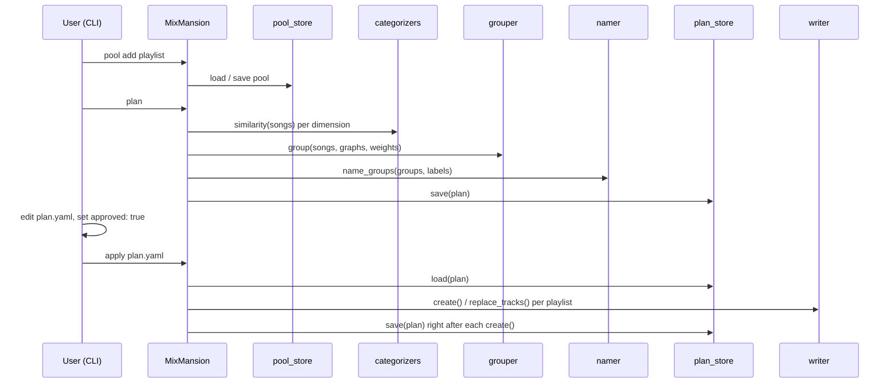

# MixMansion: developer guide

Technical deep dive and contributor guide. If you just want to use MixMansion, see [README.md](README.md).

## 1. Architecture

MixMansion is built as ports and adapters (a.k.a. hexagonal architecture). `core/` holds the domain models and the use cases; it depends on nothing else in the project. Every external concern — retrieving songs, categorizing, grouping, naming, writing to Spotify, storing pools and plans — is a *port*: an abstract interface plus a `Params` class for its adapters' settings. Each port has its own top-level folder (`retrievers/`, `categorizers/`, `groupers/`, `namers/`, `writers/`, `pool_stores/`, `plan_stores/`) containing `port.py` and one module per adapter. `interfaces/` holds the entry points that drive the app (`cli.py` now, a REST API later). `bootstrap.py` is the composition root: the only module that imports concrete adapters and wires them into `core.usecases.MixMansion`.


The CLI only calls `MixMansion` (the use-case class); `bootstrap.build_app` is the only place concrete adapter classes are imported and wired in.

### The dependency rule

- `core/models.py` imports nothing from the project.
- `core/usecases.py` imports only models, port interfaces (`*/port.py`), and `shared.config`.
- A `port.py` imports only models and `shared.config`.
- Port folders never import each other (a retriever can't import a categorizer).
- Adapters never import `core.usecases`, `interfaces`, or `bootstrap`.
- `shared/` never imports port folders, `core.usecases`, `interfaces`, or `bootstrap`.
- Only `bootstrap.py` imports concrete adapters; `interfaces/` never does.

`.importlinter` encodes every one of these rules as a contract, and `uv run lint-imports` checks them in CI. If you get a lint-imports failure, it's telling you an import crosses a boundary it shouldn't — the fix is almost always to move the dependency, not to add an ignore.

### Layout

```
src/mixmansion/
  core/            models.py, usecases.py — no adapters, no I/O
  retrievers/      port.py + one module per retriever adapter
  categorizers/    port.py + one module per categorizer adapter
  groupers/        port.py + one module per grouper adapter
  namers/          port.py + one module per namer adapter
  writers/         port.py + one module per writer adapter
  pool_stores/     port.py + one module per pool store adapter
  plan_stores/     port.py + one module per plan store adapter
  shared/          config.py, http.py, graph.py, spotify.py — helpers used by 2+ port folders
  interfaces/      cli.py (REST later)
  bootstrap.py     composition root
```

Each adapter module is small and typically has its own `Params(AdapterParams)` class declaring the settings it needs (see [Configuration](#5-configuration)). A connector that needs its own low-level client code (e.g. Spotify API calls) keeps that code inside its own folder until a second folder needs it too, at which point it moves to `shared/` (see the config rule below).

## 2. Domain model


`Song`/`SongPool` are the retrieved data; `SimilarityGraph` is one categorizer's output; `Grouping` is the grouper's output; `Plan`/`Playlist`/`PlanTrack` are what gets written to disk and, on `apply`, to Spotify.

Notes on the models (`core/models.py`):

- `SongPool.add()` dedupes by ISRC first, then by Spotify id, merging `sources` on a match. ISRC is checked first because a single and its parent album can have different Spotify track ids for the same recording.
- `SimilarityGraph.edges` maps `(song_id_a, song_id_b)` with `a < b` to a weight in `[0, 1]`; `covered` is the set of songs this dimension actually had data for (used for fusion, see [Grouping explained](#4-grouping-explained)).
- `PlanTrack.id` is validated and normalized through `parse_track_id`, which accepts a bare 22-character Spotify id, a `spotify:track:...` URI, or an `open.spotify.com/.../track/...` URL — this is what lets you paste any of the three into a plan file.
- `Playlist` rejects duplicate track ids within itself (`_no_duplicates` validator).
- `Plan.approved` is the gate `apply_plan` checks; a plan with `approved: false` cannot be applied.

## 3. Pipeline internals

`core/usecases.py` defines `MixMansion`, the single primary port every interaction surface calls. It's constructed with `settings`, an `adapters` registry (`dict[port, dict[name, class]]`), and a `make` callable that instantiates an adapter class with its dependencies — all three are supplied by `bootstrap.build_app`.

Key flows:

- **`add_to_pool`**: runs one retriever, loads the pool store, merges in the new songs (`SongPool.add`), saves, and returns counts (added / total / duplicates).
- **`build_plan`**: runs every categorizer with weight > 0 to get a `SimilarityGraph` each, runs the grouper on all of them together, runs the namer on the resulting groups, and assembles a `Plan`. After building the plan, it asserts that every pool song ended up either in a playlist or in `unassigned` — the "every song is placed" invariant — and raises `RuntimeError` if a grouper broke it. This is a defensive check on adapter correctness, not a normal user-facing error.
- **`get_plan`**: loads a plan and warns (log level WARNING) about "orphans" — songs from the plan's original pool that are in no playlist anymore, which can happen after manual edits.
- **`apply_plan`**: refuses to run unless `plan.approved`. For each playlist: if it already has a `spotify_id`, replace its tracks; if that fails because the playlist was deleted (`PlaylistNotFound`), fall through to recreating it. When creating a playlist, the use case saves the plan **immediately after** `writer.create()` returns the new id and **before** calling `replace_tracks` — so if the process crashes mid-run, re-running `apply` never creates a duplicate playlist; it just resumes.


One CLI run from `pool add` through `apply`; the plan is saved right after each playlist is created so a crash mid-`apply` never produces a duplicate playlist on retry.

## 4. Grouping explained

The `louvain` grouper (`groupers/louvain.py`, [issue #12](https://github.com/janthoXO/MixMansion/issues/12), not yet implemented) combines the per-dimension `SimilarityGraph`s into playlists:

1. **Fusion.** For a pair of songs, only the dimensions that have data for *both* songs (i.e. both are in that dimension's `covered` set) count toward the fused weight; each counted dimension's edge weight (0 if there's no edge) is averaged, weighted by the user's per-dimension weight. This means a song with no mood data (e.g. an instrumental with no lyrics) is grouped on genre alone instead of being penalized as dissimilar to everything.
2. **Communities.** The fused graph is partitioned with `networkx.community.louvain_communities`, tuned by `resolution` (higher = more, smaller groups).
3. **Merging small groups.** Communities smaller than `min_size` are repeatedly folded into the community they have the highest affinity with, until none are left undersized (or only one community remains).
4. **Soft assignment.** Each song's affinity to a community is the mean fused edge weight to that community's members. A song joins its best-fitting community, plus any other community whose affinity is within a factor of `tau` of the best (`A(s, c) >= (1 - tau) * A(s, c*)`), up to `max_memberships` playlists.
5. **Score and order.** Each song's score in a group is its affinity to that group; groups list songs sorted by score, descending, so the plan's playlist order roughly reflects "most typical first."
6. **Unassigned.** Songs with no edges at all in the fused graph land in `Grouping.unassigned` rather than being forced into a group.

Tuning knobs (env prefix `MIXMANSION_GROUPER_LOUVAIN_`, once implemented):

| Field | Default | Effect |
|---|---|---|
| `resolution` | `1.0` | Higher means more, smaller groups |
| `min_size` | `15` | Communities smaller than this get merged into another |
| `tau` | `0.05` | How close a second-best fit has to be for a song to also join that group |
| `max_memberships` | `2` | Maximum number of playlists a single song can appear in |
| `seed` | `42` | Makes runs repeatable for the same input |

## 5. Configuration

All settings live in `pydantic-settings` classes (`shared/config.py`, `shared/spotify.py`, and per-adapter `Params` classes) and are never read from the environment at import time. Precedence, most specific first:

1. **CLI flag** (or REST body field, once that interface exists)
2. **Real environment variable**
3. **`.env` file** in the working directory
4. **Default** declared on the field

`ServiceOverrides` (built by the CLI's global options, e.g. `--spotify-client-id`) carries step 1 values into `bootstrap.build_app`, which passes them as `**overrides.spotify` when constructing `SpotifySettings` — so an explicit flag always wins over env and `.env`.

### Naming scheme

App-wide settings use the `MIXMANSION_` prefix (`AppSettings` in `shared/config.py`): `MIXMANSION_WORKSPACE`, `MIXMANSION_POOL_STORE`, `MIXMANSION_WEIGHTS`, etc.

Adapter-specific settings follow `MIXMANSION_<PORT>_<ADAPTER>_<FIELD>`, e.g. `MIXMANSION_RETRIEVER_SEARCH_LIMIT` for a `limit` field on the `search` retriever, or `MIXMANSION_GROUPER_LOUVAIN_RESOLUTION`. Each adapter's `Params` class sets its own `env_prefix` in `model_config` accordingly (see `tests/fakes.py` for the pattern, e.g. `MIXMANSION_RETRIEVER_FAKE_`).

Shared clients that aren't tied to one port (Spotify, the LLM client) use their own prefix instead, e.g. `SPOTIFY_*`, `LLM_*`, `EMBEDDINGS_*` — because several adapters across different port folders share one instance of that client.

### Where config lives

Config lives next to the code that uses it. A new adapter's `Params` class lives in the adapter's own module. A low-level client (like a raw Spotify API wrapper) starts inside the one port folder that needs it first; it only moves to `shared/` once a **second** port folder needs the same client (this already happened for Spotify: `shared/spotify.py` will back the playlist retriever, the search retriever, the genre categorizer and the writer).

### Secrets

Secrets (API keys, client secrets) are always typed `SecretStr` and live on a settings class such as `SpotifySettings`, never inside an adapter's `Params`. `Params` classes are shown to the user (e.g. via `mixmansion adapters <port>`, which dumps their JSON schema) and are settable per-plan from the CLI (`--opt`), so nothing secret should ever end up there.

## 6. How to add an adapter

Walkthrough: adding a new retriever, `retrievers/example.py`.

**1. Write the adapter.**

```python
# src/mixmansion/retrievers/example.py
from pydantic_settings import SettingsConfigDict

from mixmansion.core.models import Song
from mixmansion.retrievers.port import SongRetriever
from mixmansion.shared.config import AdapterParams
from mixmansion.shared.spotify import SpotifySettings


class ExampleRetriever(SongRetriever):
    name = "example"

    class Params(AdapterParams):
        model_config = SettingsConfigDict(env_prefix="MIXMANSION_RETRIEVER_EXAMPLE_")
        limit: int = 20

    def __init__(self, spotify_settings: SpotifySettings):
        self.spotify_settings = spotify_settings

    def retrieve(self, params: Params) -> list[Song]:
        ...  # fetch and return Song objects
```

The constructor parameter `spotify_settings` is a *service name*. `bootstrap.build_app` inspects `inspect.signature(cls).parameters` and passes whichever of its known services (currently `settings` and `spotify_settings`) match by name; each service is built lazily, once, on first use. If your adapter needs a new kind of service, add it to the `services` dict in `bootstrap.build_app` — anything else raises `TypeError: <Class> needs unknown service '<name>'`.

**2. Register it in `bootstrap.py`.**

```python
from mixmansion.retrievers.example import ExampleRetriever

RETRIEVERS: dict[str, type[SongRetriever]] = {
    "example": ExampleRetriever,
}
```

This is the one and only place a concrete adapter is imported. The CLI automatically gets a `pool add example` subcommand generated from `ExampleRetriever.Params`'s fields (see `_retriever_command` in `interfaces/cli.py`) — no CLI code changes needed for a new retriever.

**3. Test it with the fakes.**

`tests/fakes.py` has an in-memory fake for every port (`FakeRetriever`, `FakeCategorizer`, `FakeGrouper`, `FakeNamer`, `FakeWriter`, `FakePoolStore`, `FakePlanStore`) so pipeline tests never touch the network. Test the new adapter's own logic directly against fixture data (mock the Spotify client, don't call the real API), and if it participates in the pipeline, exercise it through `MixMansion` built with a mix of the real adapter and fakes for everything else, following the pattern in `tests/test_pipeline.py`.

**4. Add `.env.example` keys.**

Add a commented block for any new settings, following the existing style:

```dotenv
# MIXMANSION_RETRIEVER_EXAMPLE_LIMIT=20
```

**5. Document it.**

Mention the new adapter and its settings in `README.md` (Features / Configuration) and, if it changes the architecture story, here in `README_DEV.md`.

The same pattern applies to every other port (categorizer, grouper, namer, writer, pool store, plan store) — implement the ABC in `port.py`, register the class in `bootstrap.py`, test with fakes, document.

## 7. Development workflow

```bash
uv sync                 # install dependencies (uses the lockfile)
uv run pytest           # run tests
uv run ruff check       # lint
uv run ruff format      # format (drop --check to apply)
uv run lint-imports     # check the ports & adapters boundaries (.importlinter)
```

CI (`.github/workflows/ci.yml`) runs on every push to `main` and every pull request: `uv sync --locked`, then `ruff check`, `ruff format --check`, `lint-imports`, and `pytest`, in that order. A PR won't merge cleanly unless all four pass.

## 8. Contributing

- **Issue-first.** Open or pick an existing issue before writing code; every PR should link the issue it addresses (`Closes #N`).
- **Branch naming:** `feat/<issue>-<slug>`, `fix/<issue>-<slug>`, or `docs/<issue>-<slug>`, e.g. `feat/12-louvain-grouper`.
- **Stacked PRs** (e.g. via `gh stack`) are welcome for work that naturally splits into dependent steps.
- **Commits:** conventional, imperative-mood subject lines (`add louvain grouper`, not `added` or `adding`).
- **PR checklist:**
  - [ ] Tests cover the new/changed behavior
  - [ ] `README.md` and/or `README_DEV.md` updated if user-facing behavior or architecture changed
  - [ ] `.env.example` updated if new settings were added
  - [ ] `uv run lint-imports` passes (no port-boundary violations)
- **Code style:** enforced by `ruff check` and `ruff format`; see `pyproject.toml` for the enabled rule sets (`E`, `F`, `I`, `UP`, `B`, `SIM`).
- **Reporting bugs:** open an issue with the command you ran, the error (with `--debug` output if it's a traceback), and your MixMansion version (`mixmansion --version`).

## 9. Known external API limitations

- **Spotify Web API, development-mode apps.** Spotify has restricted the Web API for apps still in development mode more than once — notably in November 2024, when audio features, recommendations, related artists, and Spotify-owned editorial/algorithmic playlists became unavailable to new apps — and again since. Check the [current Spotify Web API docs](https://developer.spotify.com/documentation/web-api) before relying on any endpoint, and never hard-code page sizes; always follow the API's own pagination (`next`) instead of assuming a fixed page count.
- **Last.fm tag matching.** The genre categorizer (planned) matches Last.fm tags by artist and title text; this can miss for typos, alternate titles, or obscure tracks, resulting in a song with no genre tags for that source.
- **LRCLIB lyrics coverage.** The mood categorizer (planned) uses LRCLIB for lyrics; not every song has lyrics available there. A song with no lyrics is "uncovered" for the lyrics-derived part of mood — it's grouped using whatever mood signal is available plus the other dimensions, not treated as dissimilar to everything (see [Grouping explained](#4-grouping-explained)).
